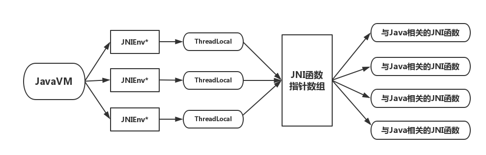

<center>JNI入门</center>
------
### 一、引言
> JNI(Java Native Interface)，Java本地接口，使得Java程序能调用或者被调用本机硬件与操作系统的语言编写的程序。

编程语言种类繁多，各有优缺点和适用范围，没有一种编程语言是万能的。

JNI是Java标准平台中的一个重要功能，它弥补了Java的与平台无关这一重大优点的不足，在JAVA实现跨平台的同时，也能与其它语言（主要是C、C++）的动态库进行交互。例如，当我们想要在Java应用程序中进行人脸识别，就可以调用已经写好的openCV的Dll动态链接库直接实现。

同样的，作为设计者的程序员也应该认识到，Java是一种与平台无关的语言，如果要保留这一特性，我们就应当在自己的程序中尽量避免使用这一功能。
Java核心技术一书建议，在一下三种情况下使用：
> * 你的应用需要访问的系统特性和设备通过Java平台是无法实现的。
> * 你已经有了大量的测试过的用另一种语言编写的代码，并且知道如何将其导出到所有的目标平台。
> * 通过基准测试，你发现使用Java代码比其他语言编写代码要慢得多。

### 二、SayHello
按照惯例，我们先来写一个简单的入门例子,编写一个`SayHello`的本地方法,介绍下JNI的使用方法。

1.首先，我们创建一个`SayHelloCpp`类，声明一个本地方法`sayHello(String name)`。
```java
package com.mike;

public class SayHelloCpp {
	public SayHelloCpp() {
	}
	public native void sayHello(String name);
}
```

2.执行javac命令得到class文件。

```
javac SayHelloCpp.java
```

3.执行javah命令从类文件中产生一个C的头文件。（提示：请在/src目录下执行该命令，包含类的包名）

```
javah com.mike.SayHelloCpp
```

得到如下的头文件:
```cpp
/* DO NOT EDIT THIS FILE - it is machine generated */
#include <jni.h>
/* Header for class com_mike_SayHelloCpp */

#ifndef _Included_com_mike_SayHelloCpp
#define _Included_com_mike_SayHelloCpp
#ifdef __cplusplus
extern "C" {
#endif
/*
 * Class:     com_mike_SayHelloCpp
 * Method:    sayHello
 * Signature: (Ljava/lang/String;)V
 */
JNIEXPORT void JNICALL Java_com_mike_SayHelloCpp_sayHello
  (JNIEnv *, jobject, jstring);

#ifdef __cplusplus
}
#endif
#endif
```
这个头文件其实就包含了`Java_com_mike_SayHelloCpp_sayHello`的声明（`JNIEXPORT`和`JNICALL`是头文件jni.h中的定义。它们为那些来自动态装载库的导出函数标明了依赖于编译器的说明符）。

4.创建Dll工程并对`Java_com_mike_SayHelloCpp_sayHello`作C（C++）的相关实现。注意包含之前生成的头文件。
```cpp
JNIEXPORT void JNICALL Java_com_mike_SayHelloCpp_sayHello
(JNIEnv *env, jobject obj, jstring name)
{
	const char *pname = env->GetStringUTFChars(name, NULL);
	std::cout << "Hello, " << pname << std::endl;
}

```

5.编译，这一步需要包含jni.h和jni_md.h。这两个文件在JDK的安装目录下能找到。
> jni.h文件定义了JNI（Java Native Interface）所支持的类型与接口。通过预编译命令可以支持C和C++。jni.h文件还依赖jni_md.h文件，jni_md.h文件定义了机器相关的jbyte, jint和jlong对应的本地类型。

注意：如果你的JDK是64位版本的，那么Java程序就应该调用编译生成的64位的Dll文件。Windows环境下，建议使用VS2008及以上版本来生成64位的Dll。

6.运行，这一步可以使用`System.load(filename)`和`System.loadLibrary(libname)`加载Dll库。前者根据Dll文件的绝对路径加载，后者则需要把Dll文件存放路径包含在本地环境变量下（注意不要加.dll）。
```
public static void main(String[] args) {
	System.load("D:/Users/Mike/Workspaces/dll/Win32Project2.dll");
	new SayHelloCpp().sayHello("mike");
}
```
输出`Hello, mike`。

### 三、jni.h
jni.h是Java程序和C程序关联的纽带，下面对jni.h做一个简要的分析。

1.JNIEnv与JavaVM

	JavaVm：是一个线程相关的结构体，代表了Java在本线程的运行环境,JNI全局只有一个。
	JNIEnv：JavaVM在线程中的代表，每个线程都有一个，JNI中可能有很多个JNIEnv。
我们看下JavaVM的结构体:
```cpp
struct JavaVM_ {
    const struct JNIInvokeInterface_ *functions;
#ifdef __cplusplus

    jint DestroyJavaVM() {
        return functions->DestroyJavaVM(this);
    }
	/* 创建 JNIEnv , 每个线程创建一个 , 调用的C语言结构提中的方法, C 与 C++ 方法相同 */  
    jint AttachCurrentThread(void **penv, void *args) {
        return functions->AttachCurrentThread(this, penv, args);
    }
	/* 释放本线程的 JNIEnv , 调用的C语言结构提中的方法, C 与 C++ 方法相同 */  
    jint DetachCurrentThread() {
        return functions->DetachCurrentThread(this);
    }

    jint GetEnv(void **penv, jint version) {
        return functions->GetEnv(this, penv, version);
    }
    jint AttachCurrentThreadAsDaemon(void **penv, void *args) {
        return functions->AttachCurrentThreadAsDaemon(this, penv, args);
    }
#endif
};
```
可以说JavaVM存在的目的就是为了让我们得到JNIEnv的。

2.JNIEnv结构体

JNIEnv提供了一系列JNI系统函数，可以用来调用Java函数或者操作jobject对象等。操作jobject对象，实质上就是操作该对象的成员变量和成员方法。

JNIEnv获取对象的成员变量和成员方法的两个函数：
`jfieldID GetFieldID(jclass clazz, const char* name, const char* sig);`
`jmethodID GetMethodID(jclass clazz, const char* name, const char* sig);`

有了成员变量的句柄，我们就可以对成员变量进行get和set操作。
`NativeType Get<type>Field(JNIEnv* env, jobject obj, jfieldID fieldID);`
`void Set<type>Field(JNIEnv* env, jobject obj, jfieldID fieldID, NativeType value);`

有了成员方法的句柄，我们可以进行函数调用。
`NativeType Call<type>Method(JNIEnv* env, jobject obj, jmethodID methodID, … );`

对于静态方法，则使用CallStatic<type>Method系列方法。
`NativeType CallStatic<type>Method(JNIEnv* env, jobject obj, jmethodID methodID, … );`


3.JNI数据类型
Java中的数据类型和JNI的数据类型存在一种对应关系。JNI的数据类型在jni.h中可以找到定义。如下表所示：

|Java类型|本地类型|JNI中定义的别名|
| --- | --- |
|int|long|jint|
|long|_int64|jlong|
|byte|signed char|jbyte|
|boolean|unsigned char|jboolean|
|char|unsigned short|jchar|
|short|short|jshort|
|float|float|jfloat|
|double|double|jdouble|
|Object|_jobject*|jobject|


4.JNI类型签名

`jmethodID GetMethodID(jclass clazz, const char* name, const char* sig);`
`g_getLocaitonID = (*env)->GetMethodID(env,clazz, "getLocation", "()Ljava/lang/String;");`
看下上面两句，`GetMethodID`的最后一个参数，表示方法的参数和返回值，这是由相应的转换规则构成的。
基本类型的JNI描述符：

| JNI字段描述符 | Java编程语言 |
| ---- | ---- |
| Z |boolean|
|B|byte|
|C|char|
|S|short|
|I|int|
|J|long|
|F|float|
|D|double|

一个引用类型的签名，例如java.lang.String，由L字母开头，并且以分号结束，包名"java.lang.String"中的"."被"/"替换。所以java.lang.String被表示为："Ljava/lang/String;"
下表提供了一个关于如何格式话方法描述符的完整的描述：

|方法描述符|java语言类型|
|---|---|
|"()Ljava/lang/String"|String f();|
|"(ILjava/lang/Class)J"|long f(int i, Class c);|
|"([B)v"|void f(byte[ ] bytes);|

5.jstring
我们知道，Java中的字符串是UTF-16编码的序列，而C的字符串是以null结尾的,所以在这两种语言中的字符串是很不一样的。Java本地接口有两组操作字符串函数，一组把Java字符串换成“改良的UTF-8”字符序列，另一组将它们转化成UTF-16数值的数组，也就是转化成jchar数组。（“改良的UTF-8”是由于历史原因造成的，编写Java虚拟机规范的时候Unicode还局限为16位）

如果你的C代码已经使用了Unicode，你可以使用第二组转换函数；如果你的字符串都仅限于使用ASCII字符，你可以使用“改良的UTF-8”转换函数。
这是两个函数的签名，前者返回“改良的UTF-8”字符序列。
`jstring NewStringUTF(const char *utf)` 
`jstring NewString(const jchar *unicode, jsize len)`

### 四、结语与扩展
其实，关于JNI的基本知识，已经大致地都介绍完了。JNI可以说是Java实现跨平台的必然产物。但也正是由于Java的跨平台特性，我们在实际开发中的使用的场景并不多。对我们开发者而言，个人认为，只有当你充分地清楚明白编写程序的目的时候再使用JNI，换句话说，这其实是一门“高深”的技术。

这里还要提一下，JNI技术其实有一个很棒的应用，那就是安卓的NDK。我们知道Android系统大多数应用都是Java开发的，但其实Android发布之初，就支持C++开发，后来Google又发布了NDK，对Java调用C++程序提供了更方便的支持。并且，大多数嵌入式设备都是使用C++开发的，可以方便地进行移植。最关键的，Android上很多的游戏开发，尤其是渲染引擎都是用C++代码开发的，这就给了NDK很大的发挥空间。

