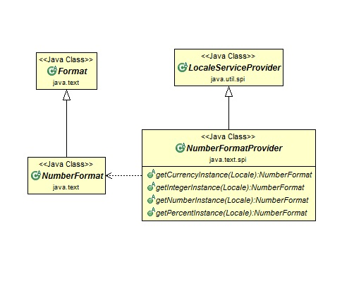
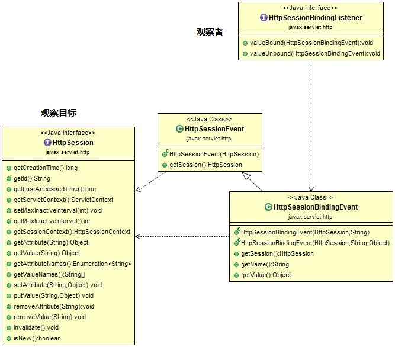
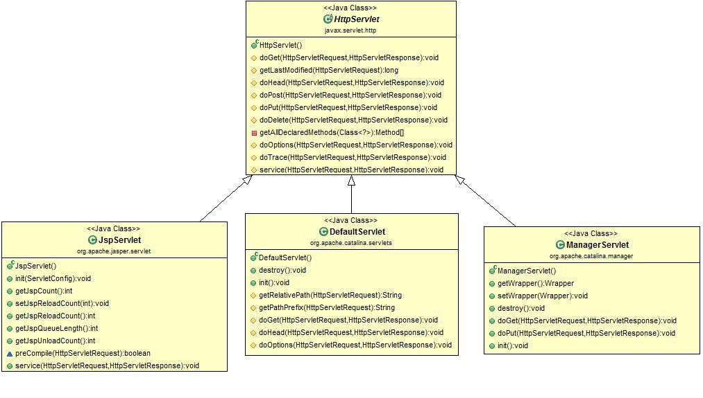
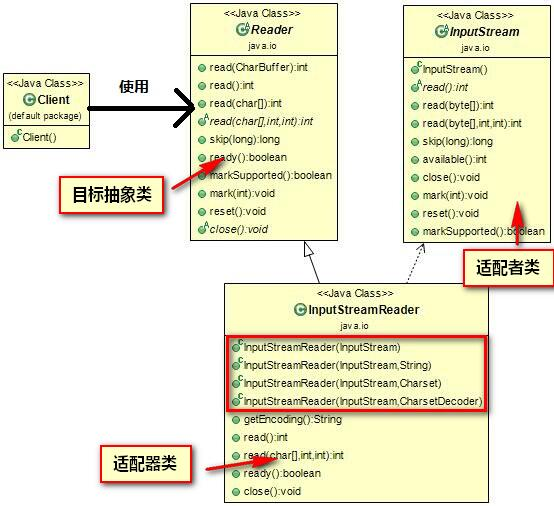
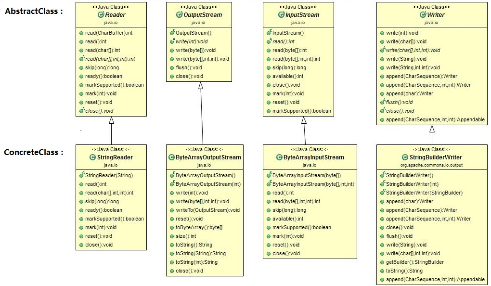

设计模式作业

---
> 请分析以下Java SE/EE API是否涉及设计模式。如果有，请说出模式名称，画出类图，并说明类图中各个角色对应哪些类。

1. 
`java.text.NumberFormat#getInstance()`
	
	
	**设计模式**：工厂模式。
	
	**角色**：
	* *工厂*：NumberFormatProvider。
	* *产品*：NumberFormat。
2. 
`javax.servlet.http.HttpSessionBindingListener`
	
	

	**设计模式**：观察者模式。

	**角色**：
	* *观察者*：HttpSessionBindingListener。
	* *观察目标*：Httpsession。
	* *具体流程*：自定义监听器继承HttpSessionBindingListener，并注册到Httpsession中，在Servlet中，传入Session的对象如果是一个实现HttpSessionBindingListener接口的对象（方便起见，此对象称为监听器），则在传入的时候（即调用HttpSession对象的setAttribute方法的时候）和移去的时候（即调用HttpSession对象的removeAttribute方法的时候或Session Time out的时候）Session对象会自动调用监听器的valueBound和valueUnbound方法。

3. 
`java.util.Collections, the checkedXXX(), synchronizedXXX() and unmodifiableXXX()methods.`

	

	**设计模式**：装饰模式。
	
	**角色**：如图。
	
4. 
`javax.servlet.http.HttpServlet, the service() and all doXXX() methods take` `HttpServletRequest and HttpServletResponse and the implementor has to process`
`them (and not to get hold of them as instance variables!).`
	
		

	**设计模式**：策略模式。

	**角色**：
	* *策略抽象类*：HttpServlet。
	* *具体策略类*：JspServlet、DefaultServlet、ManagerServlet。

5. 
`java.io.InputStreamReader(InputStream) (returns a Reader)`
	
	
	**设计模式**：适配器模式。

	**角色**：如图。

6. 
`All non-abstract methods of java.io.InputStream, java.io.OutputStream, java.io.Reader and java.io.Writer.`

	

	**设计模式**：模板方法模式。

	**角色**：
	* *AbstactClass*：Reader、OutputStream、InputStream、Writer
	* *ConcreateClass*：StringReader、ByteOutputStream、ByteArrayInputStream、StringBuilderWriter。