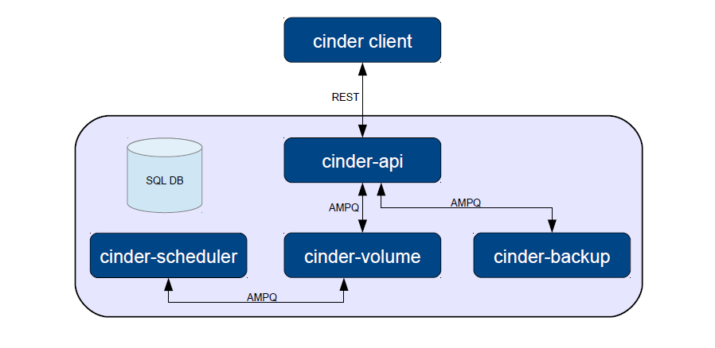

<center> OpenStack Cinder 源码解析</center>
---

### (一) 引言

	Cinder是Openstack对块存储的实现。块存储服务主要是为虚拟机提供弹性存储服务。 
	块存储服务提供高速的IO功能，能进行实时读写，类似于一个移动硬盘。
	Cinder的主要核心是对卷的管理，允许对卷、卷的类型、卷的快照进行处理。
##### Cinder块存储与Swift对象存储的比较
|\| Cinder块存储 | Swift对象存储 |
|---|---|---|
|目标定位|1.虚拟机的磁盘存储<br> 2.有性能要求的Apps<br> 3.像EBS服务一样|1.廉价、可扩展大量存储<br>2.分布式、API调用<br>3.适合备份、归档、数据的保存<br>4.像Dropbox服务一样|
|使用场景|1.应用场景<br>2.传统IT系统<br>3.数据库驱动的Apps<br>4.开发测试系统|1.VM模版<br>2.ISO镜像<br>3.硬盘存储<br>4.数据备份、数据仓库|
|工作负载|1.动态存储<br>2.小规模、随机读写<br>3.高频率、突发性的IO|1.静态存储<br>2.大量、连续读写<br>3.低IOPS|


##### Cinder的整体架构


### （二） Cinder相应客户端请求过程的分析

(1)  应用若干中间件对客户端发送过来的请求信息进行过滤（封装）处理
当客户端请求信息过来以后，会调用`/cinder/cinder/api/middleware`中的中间件进行处理:

	FaultWrapper -> RequestBodySizeLimiter -> CinderKeystoneContext -> APIRouter -> Resource

- FaultWrapper：关于错误异常的处理；
- RequestBodySizeLimiter：请求信息中body部分长度的检测；
- CinderKeystoneContext：身份验证相关；
- APIRouter：请求信息的路由处理；
- Resource：action执行前的一些预处理；


(2) 我们具体来看下最后`/cinder/cinder/api/openstack/wsgi.py`中的Resource的*def __call__(self, request)*具体实现：
```python
    def __call__(self, request):
        """WSGI method that controls (de)serialization and method dispatch."""
        LOG.info(_LI("%(method)s %(url)s"),
                 {"method": request.method,
                  "url": request.url})
        # 从request.environ中获取要执行的action方法
        action_args = self.get_action_args(request.environ)
        action = action_args.pop('action', None)
        # get_body：通过检测header，确定request body的内容类型；获取request中的body部分
        content_type, body = self.get_body(request)
        # best_match_content_type：确定请求响应的内容类型   
        accept = request.best_match_content_type()
        return self._process_stack(request, action, action_args,
                                   content_type, body, accept)
```
上面的代码主要实现了对Request的若干预处理，附上一份输出示例。
```
{
    "volume": {
        "status": "creating",
        "availability_zone": null,
        "source_volid": null,
        "display_description": null,
        "snapshot_id": null,
        "user_id": null,
        "size": 1,
        "display_name": "mike",
        "imageRef": null,
        "attach_status": "detached",
        "volume_type": null,
        "project_id": null,
        "metadata": {}
    }
}
```
(3) 再看下方法*_process_stack*，这个方法主要完成了请求信息完整的执行过程。
```python
   def _process_stack(self, request, action, action_args,
                       content_type, body, accept):
        """Implement the processing stack."""

        # Get the implementing method
        try:
            # get_method：根据request确定要执行的action方法以及相关的扩展方法
            # meth为从控制器中根据action的值获取相应的方法（例如：cinder.api.v1.volumes.VolumeController.create）
            # extensions为根据控制器和action的值获取相应的扩展方法；  
            meth, extensions = self.get_method(request, action,
                                               content_type, body)
        except (AttributeError, TypeError):
            return Fault(webob.exc.HTTPNotFound())
        except KeyError as ex:
            msg = _("There is no such action: %s") % ex.args[0]
            return Fault(webob.exc.HTTPBadRequest(explanation=msg))
        except exception.MalformedRequestBody:
            msg = _("Malformed request body")
            return Fault(webob.exc.HTTPBadRequest(explanation=msg))

         # 反序列化请求body的实现；   
        try:
            if content_type:
                #确定反序列化的方法，实现对body的反序列化操作
                contents = self.deserialize(meth, content_type, body)
            else:
                contents = {}
        except exception.InvalidContentType:
            msg = _("Unsupported Content-Type")
            return Fault(webob.exc.HTTPBadRequest(explanation=msg))
        except exception.MalformedRequestBody:
            msg = _("Malformed request body")
            return Fault(webob.exc.HTTPBadRequest(explanation=msg))

        # Update the action args
        action_args.update(contents)

        project_id = action_args.pop("project_id", None)
        context = request.environ.get('cinder.context')
        if (context and project_id and (project_id != context.project_id)):
            msg = _("Malformed request url")
            return Fault(webob.exc.HTTPBadRequest(explanation=msg))

        # 执行之前获取的扩展方法，内部执行gen = ext(req=request, **action_args)
       	# 这些扩展方法所实现的功能就是为了其匹配的action方法进行某些功能方面的补充。
		 response, post = self.pre_process_extensions(extensions,
                                                     request, action_args)
		
        if not response:
            try:
                with ResourceExceptionHandler():
		#这里执行支持action的具体方法，比如卷的create
                    action_result = self.dispatch(meth, request, action_args)
            except Fault as ex:
                response = ex

        if not response:
            # No exceptions; convert action_result into a
            # ResponseObject
            resp_obj = None
            if type(action_result) is dict or action_result is None:
				#这里对响应信息类进行了初始化操作，即形成了响应信息中若干参数的赋值；   
                resp_obj = ResponseObject(action_result)
            elif isinstance(action_result, ResponseObject):
                resp_obj = action_result
            else:
                response = action_result
			# resp_obj应该是作为响应的头文件对象；  
            if resp_obj:
                _set_request_id_header(request, resp_obj)
                # Do a preserialize to set up the response object
				# 获取用于设置响应模板的类的实例化对象
                serializers = getattr(meth, 'wsgi_serializers', {})
				# 实现绑定指定的相应模板类serializers到响应对象resp_obj操作
                resp_obj._bind_method_serializers(serializers)
                if hasattr(meth, 'wsgi_code'):
                    resp_obj._default_code = meth.wsgi_code
				# 根据accept确定相应对象所要使用的序列化方法（类），并进行类的初始化操作
                resp_obj.preserialize(accept, self.default_serializers)

                # Process post-processing extensions
                response = self.post_process_extensions(post, resp_obj,
                                                        request, action_args)

            if resp_obj and not response:
    	     # serialize：进行响应信息的序列化操作；   
     	     # 1.获取用于序列化操作的方法；   
      		 # 2.形成响应的头信息；   
    	     # 3.通过序列化操作，形成响应的body信息；   
    	     # 4.返回响应信息
                response = resp_obj.serialize(request, accept,
                                              self.default_serializers)

        try:
            msg_dict = dict(url=request.url, status=response.status_int)
            msg = _LI("%(url)s returned with HTTP %(status)d")
        except AttributeError as e:
            msg_dict = dict(url=request.url, e=e)
            msg = _LI("%(url)s returned a fault: %(e)s")

        LOG.info(msg, msg_dict)

        return response
```
具体的过程，我们已经在代码里进行了说明，这是最后的msg中的内容：
```
    response = 200 OK  
    x-compute-request-id: req-66a5680c-d160-493e-b333-7caacefc80f7  
    Content-Type: application/json  
    Content-Length: 344  
 
    {"volume": {"status": "creating",  
                "display_name": "mike",  
                "attachments": [],  
                "availability_zone": "nova",  
                "bootable": "false",  
                "created_at": "2015-11-06T14:30:52.245874",  
                "display_description": null,  
                "volume_type": "None",  
                "snapshot_id": null,  
                "source_volid": null,  
                "metadata": {},  
                "id": "e50e8f12-cc56-47eb-a488-64ae9f442464",  
                "size": 1}}
```  
至此，在Cinder模块中实现客户端发送过来的请求信息操作的主要的步骤已经全部解析完成。接下来，我们就*action_result = self.dispatch(meth, request, action_args)*中具体的代码，解析Cinder是如何实现卷的建立的。
##### (三) Cinder中建立Volume的过程解析
(1) 我们看下`/cinder/api/v1/volumes.py`中的*create*方法。

```python
  def create(self, req, body):
        """Creates a new volume."""
        if not self.is_valid_body(body, 'volume'):
            raise exc.HTTPUnprocessableEntity()

        LOG.debug('Create volume request body: %s', body)
		# 获取cinder的上下文信息
        context = req.environ['cinder.context']
        volume = body['volume']

        kwargs = {}
		# 获取请求信息中的volume_type信息
        req_volume_type = volume.get('volume_type', None)
        if req_volume_type:
            try:
                if not uuidutils.is_uuid_like(req_volume_type):
					# 通过名称或给定id获取单个的卷的类型
                    kwargs['volume_type'] = \
                        volume_types.get_volume_type_by_name(
                            context, req_volume_type)
                else:
					# 根据给定id来检索获取单个的卷的类型
                    kwargs['volume_type'] = volume_types.get_volume_type(
                        context, req_volume_type)
            except exception.VolumeTypeNotFound:
                explanation = 'Volume type not found.'
                raise exc.HTTPNotFound(explanation=explanation)
		# 从请求信息的body部分获取元数据信息
        kwargs['metadata'] = volume.get('metadata', None)
		# 从请求信息的body部分获取快照id信息
        snapshot_id = volume.get('snapshot_id')
		# 如果给定快照id信息，则根据snapshot_id获取指定的卷的快照。如果没有给定快照id信息，则赋值为None
        if snapshot_id is not None:
			# get_snapshot：获取snapshot_id指定卷的快照
            try:
                kwargs['snapshot'] = self.volume_api.get_snapshot(context,
                                                                  snapshot_id)
            except exception.NotFound:
                explanation = _('snapshot id:%s not found') % snapshot_id
                raise exc.HTTPNotFound(explanation=explanation)

        else:
            kwargs['snapshot'] = None

        source_volid = volume.get('source_volid')
        if source_volid is not None:
            try:
                kwargs['source_volume'] = \
                    self.volume_api.get_volume(context,
                                               source_volid)
            except exception.NotFound:
                explanation = _('source vol id:%s not found') % source_volid
                raise exc.HTTPNotFound(explanation=explanation)
        else:
            kwargs['source_volume'] = None

        size = volume.get('size', None)
		# 如果size为None，则从kwargs['snapshot']中或者kwargs['source_volume']中获取卷的大小值
        if size is None and kwargs['snapshot'] is not None:
            size = kwargs['snapshot']['volume_size']
        elif size is None and kwargs['source_volume'] is not None:
            size = kwargs['source_volume']['size']

        LOG.info(_LI("Create volume of %s GB"), size, context=context)
        multiattach = volume.get('multiattach', False)
        kwargs['multiattach'] = multiattach

        image_href = None
        image_uuid = None
		# 检测self.extensions中是否包含'os-image-create'
        if self.ext_mgr.is_loaded('os-image-create'):
            # NOTE(jdg): misleading name "imageRef" as it's an image-id
            image_href = volume.get('imageRef')
            if image_href is not None:
                image_uuid = self._image_uuid_from_href(image_href)
                kwargs['image_id'] = image_uuid
		# 从请求信息的body部分获取availability_zone信息
        kwargs['availability_zone'] = volume.get('availability_zone', None)

        new_volume = self.volume_api.create(context,
                                            size,
                                            volume.get('display_name'),
                                            volume.get('display_description'),
                                            **kwargs)
		# 转换new_volume格
        new_volume = dict(new_volume)
		# _translate_volume_detail_view：获取指定卷详细的重要属性信息
        retval = _translate_volume_detail_view(context, new_volume, image_uuid)

        return {'volume': retval}
```
这个方法也很好理解，主要分成3部分：
1. 根据req和body中的相关参数确定要建立卷的一些参数。
2. 调用*self.volume_api.create*实现卷的建立
3. 获取建立后卷的反馈信息，格式转换后，再返回。

(2) 我们就上一节上的第二个步骤进行展开，我们转到`/cinder/cinder/volume/api.py`中的*create*方法
```python
    def create(self, context, size, name, description, snapshot=None,
               image_id=None, volume_type=None, metadata=None,
               availability_zone=None, source_volume=None,
               scheduler_hints=None,
               source_replica=None, consistencygroup=None,
               cgsnapshot=None, multiattach=False, source_cg=None):
		#检查策略
        check_policy(context, 'create')
		#......
		#省略掉其中的一些检验操作
		#......
		#这个就是我们要创建的卷的包含的信息
        create_what = {
            'context': context,
            'raw_size': size,
            'name': name,
            'description': description,
            'snapshot': snapshot,
            'image_id': image_id,
            'raw_volume_type': volume_type,
            'metadata': metadata,
            'raw_availability_zone': availability_zone,
            'source_volume': source_volume,
            'scheduler_hints': scheduler_hints,
            'key_manager': self.key_manager,
            'source_replica': source_replica,
            'optional_args': {'is_quota_committed': False},
            'consistencygroup': consistencygroup,
            'cgsnapshot': cgsnapshot,
            'multiattach': multiattach,
        }
        try:
            sched_rpcapi = (self.scheduler_rpcapi if (not cgsnapshot and
                            not source_cg) else None)
            volume_rpcapi = (self.volume_rpcapi if (not cgsnapshot and
                             not source_cg) else None)
             # 构建并返回用于建立卷的flow
            flow_engine = create_volume.get_flow(self.db,
                                                 self.image_service,
                                                 availability_zones,
                                                 create_what,
                                                 sched_rpcapi,
                                                 volume_rpcapi)
        except Exception:
            msg = _('Failed to create api volume flow.')
            LOG.exception(msg)
            raise exception.CinderException(msg)

        # Attaching this listener will capture all of the notifications that
        # taskflow sends out and redirect them to a more useful log for
        # cinders debugging (or error reporting) usage.
        with flow_utils.DynamicLogListener(flow_engine, logger=LOG):
			#运行建立卷的flow
            flow_engine.run()
			#获取反馈信息
            vref = flow_engine.storage.fetch('volume')
            LOG.info(_LI("Volume created successfully."), resource=vref)
            return vref
```
这段代码主要做了以下的工作：
1. 构建字典create_what，实现整合建立卷的具体参数。
2. 构建并返回用于建立卷的flow。
3. 执行构建的用于建立卷的flow。
4. 从flow中获取建立卷的反馈信息。

看下*create_volume.get_flow*各个参数的含义：
> sched_rpcapi：当请求信息中没有指定要建立卷的目标主机时，通过调度器API中的方法根据具体情况应用合适的调度算法实现选取目标主机并进行建立卷的操作。
volume_rpcapi：指定了volume RPC API客户端，实现通过RPC对卷进行远程的相关操作的执行。
image_service：指定了镜像服务的接口API，主要用于当根据镜像实现卷的建立这种情况中。
availability_zones：验证availability_zone是否是可用的。
create_what：所要建立卷的规格数据信息。

(3) 对上一节中的*create_volume.get_flow*再进行展开，转到`/cinder/cinder/volume/flows/api/create_volume.py`中*get_flow*。
```python
def get_flow(db_api, image_service_api, availability_zones, create_what,
             scheduler_rpcapi=None, volume_rpcapi=None):
	# 获取flow任务的名称
 	# ACTION = 'volume:create'  
    # flow_name = 'volume_create_api'  
    flow_name = ACTION.replace(":", "_") + "_api"
	# 获取类Flow的初始化对象 
    # Flow：线性工作流管理类
    api_flow = linear_flow.Flow(flow_name)
	
 	# 添加一个给定的task到flow 
    # ExtractVolumeRequestTask：实现提取并验证输入的请求信息，并返回经过验证的参数信息，以便用于其他task当中
    # 这个task的主要任务是提取和验证输入的值，这些输入的值将形成一个潜在的卷的请求信息
    # 并且实现根据一组条件对这些输入值进行验证，并将这些输入值转换成有效的集合
    # 并返回这些经过验证和转换的输入值，这些输入值将会应用于其他task中
    api_flow.add(ExtractVolumeRequestTask(
        image_service_api,
        availability_zones,
        rebind={'size': 'raw_size',
                'availability_zone': 'raw_availability_zone',
                'volume_type': 'raw_volume_type'}))
	# 添加一个给定的task到flow
    # QuotaReserveTask：根据给定的大小值和给定的卷类型信息实现保存单一的卷
    # 根据给定的建立新卷的大小和类型，对资源配额信息进行检测，检测建立卷的可行性
    # 根据给定的建立新卷的大小和类型，实现对数据库中资源配额信息的更新
    # 保留建立新卷之前的相关资源配额信息，用于一旦卷建立的执行出现异常时，调用逆转回滚方法实现资源配额信息的恢复 
    # QuotaReserveTask：根据给定的大小值和给定的卷类型信息实现保存单一的卷
    api_flow.add(QuotaReserveTask(),
                 EntryCreateTask(db_api),
                 QuotaCommitTask())

    if scheduler_rpcapi and volume_rpcapi:
        # 添加一个给定的task到flow；  
   		# 远程调用实现卷的建立操作；
        api_flow.add(VolumeCastTask(scheduler_rpcapi, volume_rpcapi, db_api))

    # 加载但是不运行flow
    return taskflow.engines.load(api_flow, store=create_what)
```
归纳下*get_flow*方法的流程。

1.初始化一个Flow类。
2.按顺序添加相关的task到flow中。
3.返回添加task后的flow给调用者。

这是对Flow之中的*get_flow*部分的分析，其他部分还有*flow_engine.run*基本也类似，这里就不再具体分析了。