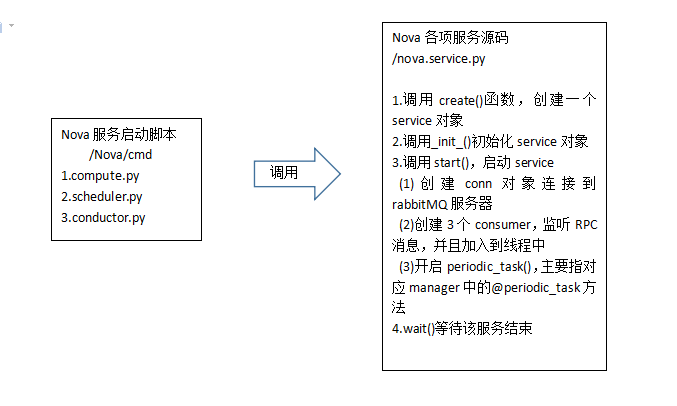

<center>Nova源码架构分析</center>
---
### (一)引言
	Nova是OpenStack云中的计算组织控制器，一个负责管理计算资源、网络、认证、所需可扩展性的平台。
	
	Nova是可以说是OpenStack中最核心的组件，OpenStack的其他组件可以说都是为Nova服务的。

	Nova服务由多个子服务构成，这些子服务间通过RPC实现通信。
  
下面是Nova主要子服务一览：

| 服务名 | 说明 | 
| ----- | ----|
|Nova API|提供HTTP服务，接收处理客户端发送的一些请求|
|Nova Compute|实现虚拟机的管理功能，包括创建、启动、暂停、关闭和删除、控制、管理镜像快照等功能|
|Nova Conduct|其实是一个RPC服务，提供对数据库查询服务|
|Nova Scheduler|Nova的调度子服务。客户端发起创建虚拟机请求时，决定将虚拟机创建在哪个计算节点上|
|Nova console, Nova vnc|控制台子服务|
|...|...

<br>
### (二) Nova服务的启动过程
(1) `/nova/cmd`目录下的一些脚本主要管理着一些进程相关的脚本，包括各种服务的启动脚本。你可以调用`all.py`启动所有的子服务。

- /nova/cmd
 + all.py
 + compute.py
 + conductor.py
 + scheduler.py
 + ......

(2) 我们看`scheduler.py`启动脚本：

```python
def main():
    #解析启动脚本和配置文件
    config.parse_args(sys.argv)
    #设置日志
    logging.setup(CONF, "nova")
    #打补丁
    utils.monkey_patch() 
    objects.register_all()
    gmr.TextGuruMeditation.setup_autorun(version)
   	#调用Service类的类方法create()实例化一个nova-scheduler的Serviced对象
    server = service.Service.create(binary='nova-scheduler',
                                    topic=CONF.scheduler_topic)
    #启动服务，等待运行结束
    service.serve(server)
    service.wait()
```

在`/nova/service.py`的*create()*方法中会读取相应的配置去初始化生成一个*service_obj*，*serve()*做全局检查，定义一个global变量，保证只启动一个服务。(一般，所有子服务公共的脚本都放在`/nova`目录下)  

(3) 我们再看下`/nova/service.py`中的*start()*方法又做了什么事：

```python
#...
#之前做一些准备工作，如打印版本信息、附加初始化信息、设置标志位、设置钩子等
#下面开始启动一个RPC的server开始监听服务端口
target = messaging.Target(topic=self.topic, server=self.host)

endpoints = [
    self.manager,
    baserpc.BaseRPCAPI(self.manager.service_name, self.backdoor_port)
]
endpoints.extend(self.manager.additional_endpoints)

serializer = objects_base.NovaObjectSerializer()

self.rpcserver = rpc.get_server(target, endpoints, serializer)
self.rpcserver.start()

self.manager.post_start_hook()

LOG.debug("Join ServiceGroup membership for this service %s",
          self.topic)
#主要把服务加到一个周期性执行的服务组里面去，执行周期性任务periodic_tasks
self.servicegroup_api.join(self.host, self.topic, self)
if self.periodic_enable:
    if self.periodic_fuzzy_delay:
        initial_delay = random.randint(0, self.periodic_fuzzy_delay)
    else:
        initial_delay = None

    self.tg.add_dynamic_timer(self.periodic_tasks,
                             initial_delay=initial_delay,
                             periodic_interval_max=
                                self.periodic_interval_max) 
```

> OpenStack中默认使用kombu（实现AMQP协议的Python函数库）连接RabbitMQ服务器。消息的收/发者都需要一个Connetion对象连接RabbitMQ服务器。Nova的每个组件都会连接消息服务器，收发消息的方式有同步`rpc.call`和异步`rpc.cast`。

>*self.periodic_tasks*是开启自己文件夹目录下的`manager.py`中所有被@periodic_task修饰的函数如nova-compute的`manager.py`中的下面这段就是周期性地更新可用和已用的资源信息，汇报给管理者。
```python
    @periodic_task.periodic_task(spacing=CONF.update_resources_interval)
    def update_available_resource(self, context):
```

至此一个服务的启动算是完成了,附上一份简图。


### (三) Nova创建虚拟机实例的内部过程分析
我们以Nova创建虚拟机的过程为例，浏览一遍Nova的主要组件
(1) `/nova/api/`提供了对外提高了REST接口的服务，我们就从这里找虚拟机实例启动过程的入口。我们找到`/nova/api/openstack/compute`目录下的`servers.py`：
```python
    #这是虚拟机创建的入口，req获得http的报文内容，body中就是REST传递过来的参数，包含获取用户名、密码、创建虚拟机的参数等
    def create(self, req, body):
        """Creates a new server for a given user."""

        context = req.environ['nova.context']
        server_dict = body['server']
        password = self._get_server_admin_password(server_dict)
        name = common.normalize_name(server_dict['name'])

        # Arguments to be passed to instance create function
        create_kwargs = {}
        if list(self.create_extension_manager):
            self.create_extension_manager.map(self._create_extension_point,
                                              server_dict, create_kwargs, body)
        availability_zone = create_kwargs.get("availability_zone")
        target = {
            'project_id': context.project_id,
            'user_id': context.user_id,
            'availability_zone': availability_zone}
		#在这一步完成各项请求授权的验证工作
        authorize(context, target, 'create')
		#......
		#网络也在这一步也进行授权验证
        if requested_networks and len(requested_networks):
            authorize(context, target, 'create:attach_network')

		#......完成参数的转换工作
```
紧接着看下面这部分代码可以知道，在参数转化完成后，*create()*最后会去调用compute-api的*create()*方法。
```python
(instances, resv_id) = self.compute_api.create(context,
                inst_type,
                image_uuid,
                display_name=name,
                display_description=name,
                metadata=server_dict.get('metadata', {}),
                admin_password=password,
                requested_networks=requested_networks,
                check_server_group_quota=True,
                **create_kwargs)
		#......一些捕获异常的代码
```
(2) `/nova/nova/compute/api.py`下的comput-api提供管理compute的api，外部模块通过这些接口完成对计算资源的操作。
```python
 #nova-api中的create()方法调用compute-api中create方法
 def create(self, context, instance_type,
               image_href, kernel_id=None, ramdisk_id=None,
               min_count=None, max_count=None,
               display_name=None, display_description=None,
               key_name=None, key_data=None, security_group=None,
               availability_zone=None, user_data=None, metadata=None,
               injected_files=None, admin_password=None,
               block_device_mapping=None, access_ip_v4=None,
               access_ip_v6=None, requested_networks=None, config_drive=None,
               auto_disk_config=None, scheduler_hints=None, legacy_bdm=True,
               shutdown_terminate=False, check_server_group_quota=False):
        """Provision instances, sending instance information to the
        scheduler.  The scheduler will determine where the instance(s)
        go and will handle creating the DB entries.

        Returns a tuple of (instances, reservation_id)
        """
		#policy是nova中一个资格验证机制，验证是否有创建实例的资格
        self._check_create_policies(context, availability_zone,
                requested_networks, block_device_mapping)
		#是否有网络要求
        if requested_networks and max_count > 1:
            self._check_multiple_instances_and_specified_ip(requested_networks)
            if utils.is_neutron():
                self._check_multiple_instances_neutron_ports(
                    requested_networks)
		#创建实例的函数
        return self._create_instance(
                       context, instance_type,
                       image_href, kernel_id, ramdisk_id,
                       min_count, max_count,
                       display_name, display_description,
                       key_name, key_data, security_group,
                       availability_zone, user_data, metadata,
                       injected_files, admin_password,
                       access_ip_v4, access_ip_v6,
                       requested_networks, config_drive,
                       block_device_mapping, auto_disk_config,
                       scheduler_hints=scheduler_hints,
                       legacy_bdm=legacy_bdm,
                       shutdown_terminate=shutdown_terminate,
                       check_server_group_quota=check_server_group_quota)
```
(3) *在_create_instance()*，首先也是验证各种参数，如实例类型是否存在、租户配额限制检查等。最后会调用*self.compute_task_api.build_instances(context,***)。compute_task_api实际上是一个conductor的对象。我们再跳到`/nova/conductor/api.py`下：
```python
    def build_instances(self, context, instances, image, filter_properties,
            admin_password, injected_files, requested_networks,
            security_groups, block_device_mapping, legacy_bdm=True):
        self.conductor_compute_rpcapi.build_instances(context,
                instances=instances, image=image,
                filter_properties=filter_properties,
                admin_password=admin_password, injected_files=injected_files,
                requested_networks=requested_networks,
                security_groups=security_groups,
                block_device_mapping=block_device_mapping,
                legacy_bdm=legacy_bdm)
```
(4) 我们看到compute调用了conductor的rpcAPI接口，转到`/nova/conductor/rpcapi.py`，看到这里采用异步通信的方式通信，conductor发送了一个rpc消息。
```python
cctxt = self.client.prepare(version=version)
cctxt.cast(context, 'build_instances', **kw)
```


> 我们知道Nova各组件之间是通过RPC来进行通信的，为了增加理解，这里补充点知识，server、manager、driver之间的关系：
> * server是一个服务进程，类似于Linux中的守护进程。一个server对应一个rpcAPI（我们之前源码里看到启动服务的过程中就启动了一个rpcServer），接收特定的的topic消息。server接收到请求后会交给manager去处理。一个server具体有什么功能由manager来决定
> * manager是一个服务请求的管理者，接收请求，具体的工作是由下面的workers来完成。
> * 一个manager可以对应多个driver。driver可以理解为一个适配器，比如虚拟化我可以选择用xem，kvm，这就相当于两个driver。


通过上面的rpc消息传递的原理，我们知道`/nova/conductor/manager.py`中就会有相应的*build_instances()*。果然，我们找到了这个函数，看下它又做了什么，我们看到下面几段代码
```python
#......
#通过scheduler选择符合选择符合条件的主机
try:
    scheduler_utils.setup_instance_group(context, request_spec,
                                         filter_properties)
    #这步，即使我们进行多次尝试，也只会有唯一的实例
    scheduler_utils.populate_retry(filter_properties,
        instances[0].uuid)
    hosts = self.scheduler_client.select_destinations(context,

            request_spec, filter_properties)
#......
#函数最后把控制权交还给compute,通信方式当然是又一次的RPC调用了
self.compute_rpcapi.build_and_run_instance(context,
        instance=instance, host=host['host'], image=image,
        request_spec=request_spec,
        filter_properties=local_filter_props,
        admin_password=admin_password,
        injected_files=injected_files,
        requested_networks=requested_networks,
        security_groups=security_groups,
        block_device_mapping=bdms, node=host['nodename'],
        limits=host['limits'])
```
(4) 最后，我们再回到`/nova/nova/compute/manager.py`中，基本上最后创建的实例化工作就在compute内部完成了。列一下调用顺序*build_and_run_instance* --> *_do_build_and_run_instance* --> *_build_and_run_instance*。
这步会非常耗时，所以在*build_and_run_instance*中把RPC worker归还给原来的线程池中，并加锁调用*_do_build_and_run_instance*，在加载完虚拟机的配置文件后去调用 *_build_and_run_instance*，最后完成img镜像的加载和虚拟机的初始化工作:
```python
@utils.synchronized(instance.uuid)
def _locked_do_build_and_run_instance(*args, **kwargs):
    with self._build_semaphore:
        self._do_build_and_run_instance(*args, **kwargs)
	#把RPC worker连接先归还。
utils.spawn_n(_locked_do_build_and_run_instance,
              context, instance, image, request_spec,
              filter_properties, admin_password, injected_files,
              requested_networks, security_groups,
              block_device_mapping, node, limits)

```
好了，以上就是创建虚拟机的大致流程，具体细节没有再深入下去。这是根据上面步骤的流程图:
