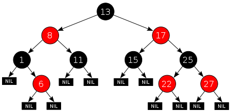

<center>Java TreeMap 源码分析</center>
---
### (一) 引言
	大家可能对HashMap比较熟悉，对TreeMap了解不多。这里面是有原因：
	一方面HashMap的使用场景比较多；二是相对于HashMap来说，TreeMap所用到的数据结构更为复杂。
先粗劣比较下这两个类：
```java
public class TreeMap<K,V>
    extends AbstractMap<K,V>
    implements NavigableMap<K,V>, Cloneable, java.io.Serializable
```
```java
public class HashMap<K,V> extends AbstractMap<K,V>
    implements Map<K,V>, Cloneable, Serializable {
```
可以看到，相比HashMap来说，TreeMap多继承了一个接口NavigableMap，也就是这个接口，决定了TreeMap与HashMap的不同：
> HashMap的key是无序的，TreeMap的key是有序的。


再看下一下两个签名：
```java
public interface NavigableMap<K,V> extends SortedMap<K,V>
```
```java
public interface SortedMap<K,V> extends Map<K,V>
```
`SortedMap`就像其名字那样，说明这个Map是有序的。插入SortedMap中的key的类都必须继承Comparable类（或指定一个comparator），否则在插入时就会报ClassCastException异常。

此外，SortedMap中key的顺序性应该与equals方法保持一致。也就是说m1.compareTo(m2)或comparator.compare(m1, m2)为true时，m1.equals(m2)也应该为true。

### (二) TreeMap的内部原理
TreeMap是用红黑树作为基础实现的，红黑树是一种二叉搜索树。下面简单介绍下这两个概念。

##### 1. 二叉搜索树
看下二叉搜索树(binary search tree，BST):
<br><br>
二叉搜索树的性质其实很简单：左子树的值小于根节点，右子树的值大于根节点。
当我要找一个节点时，每经过一次判断就能将问题的规模减少一半，所以如果二叉搜索树是平衡的话，查找元素的时间复杂度为log(n)，也就是树的高度。
那么如果二叉搜索树每经过一次判断就能将数据规模减少一半的话，三叉搜索树进行一次判断不就把数据规模减少2/3了吗。那么到底分叉为多少，才能达到最优效果呢？
##### 2. K叉搜索树
就上一小节的问题，引入K叉搜索树的概念。三叉搜索树在将问题规模减少三分之二时，所需比较操作的次数是两次（二叉搜索树再将问题规模减少一半时，只需要一次比较操作）。因此，n个元素的K叉搜索树的时间复杂度就为
`k*log(n/k)`
其中n为常量，我们对方程取极值。
`k*log(n/k)=ln(n)*k/ln(k)`
当k=e时，k/ln(k)取最小值，e为自然对数函数的底数，e≈2.71828。
```javascript
function foo(k) {return k/Math.log(k);}
foo(2)
2.8853900817779268
foo(3)
2.730717679880512
foo(4)
2.8853900817779268
```
好像k=3时比k=2时得到的结果更小？但为什么我们平时用的都是二叉搜索树呢？
> 其实，现在的CPU内部可以针对二重逻辑（binary logic）的代码做优化，而三重逻辑会被分解为多个二重逻辑来处理。

##### 3. 红黑树
通过上面的知识，我们知道了什么是二叉搜索树，接下来看下红黑树，先上图。

<br><br>

红黑树一般有以下限制：

1. 节点是红色或黑色。
2. 根是黑色。
3. 所有叶子都是黑色（叶子是NIL节点）。
4. 每个红色节点必须有两个黑色的子节点。（从每个叶子到根的所有路径上不能有两个连续的红色节点。）
5. 从任一节点到其每个叶子的所有简单路径都包含相同数目的黑色节点。

满足了上面5个条件后，就能够保证：
> 根节点到叶子节点的最长路径不会大于根节点到叶子最短路径的2倍。

其实这个很好理解，主要是用了性质4与5，这里简单说下：
> 假设根节点到叶子节点最短的路径中，黑色节点数目为B，那么根据性质5，根节点到叶子节点的最长路径中，黑色节点数目也是B，最长的情况就是每两个黑色节点中间有个红色节点（也就是红黑相间的情况），所以红色节点最多为B－1个。这样就能证明上面的结论了。

至于红黑树如何插入、删除、左旋、右旋就留到下一节分析了。
### (三) TreeMap的java代码实现
树的左旋和右旋，主要用来调整一棵树的平衡。


<br><br>
##### 1. 左旋


代码：
```java
private void rotateLeft(Entry<K, V> p) {
    if (p != null) {
        // 获取P的右子节点
        Entry<K, V> r = p.right;
        // 将R的左子树设置为P的右子树
        p.right = r.left;
        // 若R的左子树不为空，则将P设置为R左子树的父亲
        if (r.left != null)
            r.left.parent = p;
        // 将P的父亲设置R的父亲
        r.parent = p.parent;
        // 如果P的父亲为空，则将R设置为根节点
        if (p.parent == null)
            root = r;
        // 如果P为其父节点（G）的左子树，则将R设置为P父节点(G)左子树
        else if (p.parent.left == p)
            p.parent.left = r;
        // 否则R设置为P的父节点（G）的右子树
        else
            p.parent.right = r;
        // 将P设置为R的左子树
        r.left = p;
        // 将R设置为P的父节点
        p.parent = r;
    }
}
```

##### 2. 右旋
右旋逻辑与左旋一致，这里就不再详述，附上图片。


##### 3. 插入
对于新节点的插入有如下三个关键地方：
* 插入新节点总是红色节点 。
* 如果插入节点的父节点是黑色, 能维持性质 。
* 如果插入节点的父节点是红色, 破坏了性质. 故插入算法就是通过重新着色或旋转,来维持性质。

代码：
```java
public V put(K key, V value) {  
     //用t表示二叉树的当前节点  
     Entry<K,V> t = root;  
     //t为null表示一个空树，即TreeMap中没有任何元素，直接插入  
     if (t == null) {  
         //比较key值，个人觉得这句代码没有任何意义，空树还需要比较、排序？  
         compare(key, key); // type (and possibly null) check  
         //将新的key-value键值对创建为一个Entry节点，并将该节点赋予给root  
         root = new Entry<>(key, value, null);  
         //容器的size = 1，表示TreeMap集合中存在一个元素  
         size = 1;  
         //修改次数 + 1  
         modCount++;  
         return null;  
     }  
     int cmp;     //cmp表示key排序的返回结果  
     Entry<K,V> parent;   //父节点  
     // split comparator and comparable paths  
     Comparator<? super K> cpr = comparator;    //指定的排序算法  
     //如果cpr不为空，则采用既定的排序算法进行创建TreeMap集合  
     if (cpr != null) {  
         do {  
             parent = t;      //parent指向上次循环后的t  
             //比较新增节点的key和当前节点key的大小  
             cmp = cpr.compare(key, t.key);  
             //cmp返回值小于0，表示新增节点的key小于当前节点的key，则以当前节点的左子节点作为新的当前节点  
             if (cmp < 0)  
                 t = t.left;  
             //cmp返回值大于0，表示新增节点的key大于当前节点的key，则以当前节点的右子节点作为新的当前节点  
             else if (cmp > 0)  
                 t = t.right;  
             //cmp返回值等于0，表示两个key值相等，则新值覆盖旧值，并返回新值  
             else  
                 return t.setValue(value);  
         } while (t != null);  
     }  
     //如果cpr为空，则采用默认的排序算法进行创建TreeMap集合  
     else {  
         if (key == null)     //key值为空抛出异常  
             throw new NullPointerException();  
         /* 下面处理过程和上面一样 */  
         Comparable<? super K> k = (Comparable<? super K>) key;  
         do {  
             parent = t;  
             cmp = k.compareTo(t.key);  
             if (cmp < 0)  
                 t = t.left;  
             else if (cmp > 0)  
                 t = t.right;  
             else  
                 return t.setValue(value);  
         } while (t != null);  
     }  
     //将新增节点当做parent的子节点  
     Entry<K,V> e = new Entry<>(key, value, parent);  
     //如果新增节点的key小于parent的key，则当做左子节点  
     if (cmp < 0)  
         parent.left = e;  
   //如果新增节点的key大于parent的key，则当做右子节点  
     else  
         parent.right = e;  
     /*  
      *  上面已经完成了排序二叉树的的构建，将新增节点插入该树中的合适位置  
      *  下面fixAfterInsertion()方法就是对这棵树进行调整、平衡，具体过程参考上面的五种情况  
      */  
     fixAfterInsertion(e);  
     //TreeMap元素数量 + 1  
     size++;  
     //TreeMap容器修改次数 + 1  
     modCount++;  
     return null;  
}
```
##### 4. 插入后的修正
插入节点分为下列五中情况，分别对这5钟情况进行处理：
一、为根节点
> 直接把此结点涂为黑色。

二、父节点为黑色
> 什么也不做。

三、当前结点的父结点是红色且祖父结点的另一个子结点（叔叔结点）是红色。
> 将当前节点的父节点和叔叔节点涂黑，祖父结点涂红，把当前结点指向祖父节点，从新的当前节点重新开始算法。


四、当前节点的父节点是红色,叔叔节点是黑色，当前节点是其父节点的右孩子
> 当前节点的父节点做为新的当前节点，以新当前节点为支点左旋。


五、当前节点的父节点是红色,叔叔节点是黑色，当前节点是其父节点的左孩子
> 父节点变为黑色，祖父节点变为红色，在祖父节点为支点右旋。


代码：
```java
private void fixAfterInsertion(Entry<K,V> x) {  
    x.color = RED;    //新增节点的颜色为红色  
    //循环 直到 x不是根节点，且x的父节点不为红色  
    while (x != null && x != root && x.parent.color == RED) {  
        //如果X的父节点是其父节点的父节点的左节点  
        if (parentOf(x) == leftOf(parentOf(parentOf(x)))) {  
            //获取X的叔节点
            Entry<K,V> y = rightOf(parentOf(parentOf(x)));  
            //如果X的叔节点为红色（情况三）  
            if (colorOf(y) == RED) {       
                //将X的父节点设置为黑色  
                setColor(parentOf(x), BLACK);  
                //将X的叔节点设置为黑色  
                setColor(y, BLACK);  
                //将X的父节点的父节点设置红色  
                setColor(parentOf(parentOf(x)), RED);  
                x = parentOf(parentOf(x));  
            }  
            //如果X的叔节点；这里会存在两种情况（情况四、情况五）  
            else {     
                //如果X节点为其父节点的右子树，则进行左旋转（情况四）  
                if (x == rightOf(parentOf(x))) {  
                    //将X的父节点作为X  
                    x = parentOf(x);  
                    //右旋转  
                    rotateLeft(x);  
                }  
                //（情况五）  
                //将X的父节点（P）设置为黑色  
                setColor(parentOf(x), BLACK);  
                //将X的父节点的父节点设置红色  
                setColor(parentOf(parentOf(x)), RED);  
                //以X的父节点的父节点为中心右旋转  
                rotateRight(parentOf(parentOf(x)));  
            }  
        }  
        //如果X的父节点是其父节点的父节点的右节点  
        else {  
            //获取X的叔节点 
            Entry<K,V> y = leftOf(parentOf(parentOf(x)));  
          //如果X的叔节点为红色（情况三）  
            if (colorOf(y) == RED) {  
                //将X的父节点设置为黑色  
                setColor(parentOf(x), BLACK);  
                //将X的叔节点设置为黑色  
                setColor(y, BLACK);  
                //将X的父节点的父节点（G）设置红色  
                setColor(parentOf(parentOf(x)), RED);  
                x = parentOf(parentOf(x));  
            }  
          //如果X的叔节点为黑色；这里会存在两种情况（情况四、情况五）  
            else {  
                //如果X节点为其父节点的右子树，则进行左旋转（情况四）  
                if (x == leftOf(parentOf(x))) {  
                    //将X的父节点作为X  
                    x = parentOf(x);  
                   //右旋转  
                    rotateRight(x);  
                }  
                //（情况五）  
                //将X的父节点设置为黑色  
                setColor(parentOf(x), BLACK);  
                //将X的父节点的父节点设置红色  
                setColor(parentOf(parentOf(x)), RED);  
                //以X的父节点的父节点为中心右旋转  
                rotateLeft(parentOf(parentOf(x)));  
            }  
        }  
    }  
    //将根节点强制设置为黑色  
    root.color = BLACK;  
} 
```

##### 5. 删除
删除分为以下几种情况，下面一一进行讨论：
情况 1、无子节点（红色节点）
> 这种情况对该节点直接删除即可。

情况 2、有一个子节点
> 用子节点替代待删除节点，然后删除子节点即可。

情况 3、有两个子节点
> 需要找到一个节点替代待删除节点（N），然后删除N即可。

情况 3.1、N的兄弟节点W为红色。
> 改变W、P的颜色，然后进行一次左旋转，这样处理后将情况3.1、转变为3.2、3.3、3.4中的一种。

<br><br>
情况 3.2、N的兄弟w是黑色的，且w的俩个孩子都是黑色的。
> 将W由黑转变为红，如果new x为红色，直接将x转变为黑色，保持整棵树的平衡。否则情况3.2会转变为情况3.1、3.3、3.4中的一种。


<br><br>
情况 3.3、N的兄弟w是黑色的，w的左孩子是红色，w的右孩子是黑色。
> 将节点W和其左子节点进行颜色交换，然后对W进行右旋转处理，将情况3.3转化为情况3.4。


<br><br>
情况 3.4、N的兄弟w是黑色的，且w的右孩子时红色的。


> 交换W和父节点P的颜色，同时对P进行左旋转操作，同时将W的右子节点X2置黑。

代码：
```java
private void deleteEntry(Entry<K,V> p) {  
        modCount++;      //修改次数 +1  
        size--;          //元素个数 -1  
  
        /* 
         * 被删除节点的左子树和右子树都不为空，那么就用 p节点的中序后继节点代替 p 节点 
         * successor(P)方法为寻找P的替代节点。规则是右分支最左边，或者 左分支最右边的节点 
         * ---------------------（1） 
         */  
        if (p.left != null && p.right != null) {    
            Entry<K,V> s = successor(p);  
            p.key = s.key;  
            p.value = s.value;  
            p = s;  
        }  
  
        //replacement为替代节点，如果P的左子树存在那么就用左子树替代，否则用右子树替代  
        Entry<K,V> replacement = (p.left != null ? p.left : p.right);  
  
        /* 
         * 删除节点，分为上面提到的三种情况 
         * -----------------------（2） 
         */  
        //如果替代节点不为空  
        if (replacement != null) {  
            replacement.parent = p.parent;  
            /* 
             *replacement来替代P节点 
             */  
            //若P没有父节点，则根节点直接变成replacement  
            if (p.parent == null)  
                root = replacement;  
            //如果P为左节点，则用replacement来替代为左节点  
            else if (p == p.parent.left)  
                p.parent.left  = replacement;  
          //如果P为右节点，则用replacement来替代为右节点  
            else  
                p.parent.right = replacement;  
  
            //同时将P节点从这棵树中剔除掉  
            p.left = p.right = p.parent = null;  
  
            /* 
             * 若P为红色直接删除，红黑树保持平衡 
             * 但是若P为黑色，则需要调整红黑树使其保持平衡 
             */  
            if (p.color == BLACK)  
                fixAfterDeletion(replacement);  
        } else if (p.parent == null) {     //p没有父节点，表示为P根节点，直接删除即可  
            root = null;  
        } else {      //P节点不存在子节点，直接删除即可  
            if (p.color == BLACK)         //如果P节点的颜色为黑色，对红黑树进行调整  
                fixAfterDeletion(p);  
  
            //删除P节点  
            if (p.parent != null) {  
                if (p == p.parent.left)  
                    p.parent.left = null;  
                else if (p == p.parent.right)  
                    p.parent.right = null;  
                p.parent = null;  
            }  
        }  
    }  
```

```java
private void fixAfterDeletion(Entry<K,V> x) {  
        // 删除节点需要一直迭代，知道 直到 x 不是根节点，且 x 的颜色是黑色  
        while (x != root && colorOf(x) == BLACK) {  
            if (x == leftOf(parentOf(x))) {      //若X节点为左节点  
                //获取其兄弟节点  
                Entry<K,V> sib = rightOf(parentOf(x));  
  
                /* 
                 * 如果兄弟节点为红色----（情况3.1） 
                 * 策略：改变W、P的颜色，然后进行一次左旋转 
                 */  
                if (colorOf(sib) == RED) {       
                    setColor(sib, BLACK);       
                    setColor(parentOf(x), RED);    
                    rotateLeft(parentOf(x));  
                    sib = rightOf(parentOf(x));  
                }  
  
                /* 
                 * 若兄弟节点的两个子节点都为黑色----（情况3.2） 
                 * 策略：将兄弟节点编程红色 
                 */  
                if (colorOf(leftOf(sib))  == BLACK &&  
                    colorOf(rightOf(sib)) == BLACK) {  
                    setColor(sib, RED);  
                    x = parentOf(x);  
                }   
                else {  
                    /* 
                     * 如果兄弟节点只有右子树为黑色----（情况3.3） 
                     * 策略：将兄弟节点与其左子树进行颜色互换然后进行右转 
                     * 这时情况会转变为3.4 
                     */  
                    if (colorOf(rightOf(sib)) == BLACK) {  
                        setColor(leftOf(sib), BLACK);  
                        setColor(sib, RED);  
                        rotateRight(sib);  
                        sib = rightOf(parentOf(x));  
                    }  
                    /* 
                     *----情况3.4 
                     *策略：交换兄弟节点和父节点的颜色， 
                     *同时将兄弟节点右子树设置为黑色，最后左旋转 
                     */  
                    setColor(sib, colorOf(parentOf(x)));  
                    setColor(parentOf(x), BLACK);  
                    setColor(rightOf(sib), BLACK);  
                    rotateLeft(parentOf(x));  
                    x = root;  
                }  
            }   
              
            /** 
             * X节点为右节点与其为做节点处理过程差不多，这里就不在累述了 
             */  
		//......
		//......     
  		//最后把x的颜色置为黑色
        setColor(x, BLACK);  
    }
```

### (四) 违反高质量代码的案例
关于违反高质量代码的案例，TreeMap代码量较少，我把范围扩大到了整个java.util包。
##### 1. Dead store to local variable that shadows fied
`/java/util/regex/Pattern.java line 2946`
这里temp定义后并没有被使用。
```java
if (head.study(info)) { // Deterministic
	//------
    GroupTail temp = (GroupTail) tail;
	//------
    head = root = new GroupCurly(head.next, curly.cmin,
                       curly.cmax, curly.type,
                       ((GroupTail)tail).localIndex,
                       ((GroupTail)tail).groupIndex,
                                 capturingGroup);
    return head;
} 
```
##### 2. Null pointer dereference
`/java/util/regex/Pattern.java line 2859`
如果这里不加`if(tail != null)`判断的话,会产生空指针异常。
```java
tail = root;
head.next = expr(tail);
//------
tail.next = lookbehindEnd;
//------
TreeInfo info = new TreeInfo();
```
##### 3. Method with Optional return type returns explicit null
`/java/util/stream/FindOps.java line 193`
方法有可选择的返回参数时，不能显示地返回为空。
```java
static final class OfRef<T> extends FindSink<T, Optional<T>> {
        @Override
        public Optional<T> get() {
			//------
            return hasValue ? Optional.of(value) : null;
			//------
        }
    }
```
##### 4. Return value of putIfAbsent ignored, value passed to putIfAbsent reused
`/java/util/Calendar.java line 3341`
putIfAbsent的返回值被忽略，但是data在setWeekCountData还是有使用的。
```java
    private void setWeekCountData(Locale desiredLocale)
    {
        int[] data = cachedLocaleData.get(desiredLocale);
        if (data == null) {  /* cache miss */
            data = new int[2];
            data[0] = CalendarDataUtility.retrieveFirstDayOfWeek(desiredLocale);
            data[1] = CalendarDataUtility.retrieveMinimalDaysInFirstWeek(desiredLocale);
			//------
            cachedLocaleData.putIfAbsent(desiredLocale, data);
			//------        
		}
        firstDayOfWeek = data[0];
        minimalDaysInFirstWeek = data[1];
    }
```
##### 5. instanceof will always retuern false
`/java/util/regex/Pattern.java line 5440`
下面这个instanceof判断永远返回false。
```java
if (node instanceof SliceS)
    return new BnMS(src, lastOcc, optoSft, node.next);
```
##### 6. Method dose not release lock on all paths
没有任何释放锁的途径。
`/java/util/concurrent/PriorityBlockingQueue.java line 312`
```java
if (node instanceof SliceS)
    return new BnMS(src, lastOcc, optoSft, node.next);
```
##### 7. An increment to a volatile field isn't atomic
`/java/util/concurrent/ThreadPoolExecutor.java line 1154`
对volatile的的自操作并不具有原子性，正确的做法应该是：
volatile int v = 0;
r1 = v;
r2 = r1 + 1;
v = r2;
##### 8. Invocation of toString on an array
`/java/util/concurrent/ThreadPoolExecutor.java line 668`
对数组的toString的调用，建议使用Arrays.toString()。
```java
if (result != ERROR_SUCCESS && result != ERROR_FILE_NOT_FOUND) {
    logger().warning("Could not delete windows registry "
    + "value " + byteArrayToString(windowsAbsolutePath())+ "\\" +
    //------
    toWindowsName(key) + " at root 0x" +
	//------
    Integer.toHexString(rootNativeHandle()) +
    ". Windows RegDeleteValue(...) returned error code " +
    result + ".");
    isBackingStoreAvailable = false;
}
```
##### 9. Comparision of String objects using == or !=
`/java/util/ResourceBundle.java line 2903`
对String对象比较不能使用 == 或者 != ，应使用equals。
```java
StringBuilder sb = new StringBuilder(baseName);
sb.append('_');
if (script != "") {
    if (variant != "") {
		//------
        sb.append(language).append('_').append(script).append('_').append(country).append('_').append(variant);
    } else if (country != "") {
        sb.append(language).append('_').append(script).append('_').append(country);
    } else {
        sb.append(language).append('_').append(script);
		//------
    }
}
```
##### 10. Method with Boolean return type returns explicit null
`/java/util/stream.MatchOps.java line 309`
对于Boolean的返回值，应只返回true或者false。
```java
protected Boolean doLeaf() {
    boolean b = helper.wrapAndCopyInto(op.sinkSupplier.get(), spliterator).getAndClearState();
    if (b == op.matchKind.shortCircuitResult)
        shortCircuit(b);
    return null;
}
```
##### 11. Class's readObject() method is synchronized
`/java/util/PropertyPermission.java line 403`
这里定义了一个同步的readObject()方法，但根据定义，通过反序列化创建的一个对象本身就是只有一个线程可以到达的，因此没有必要。如果是readObject()方法本身导致对象能被另一个线程可见，这是一个非常可疑的编码风格。
```java
private synchronized void readObject(java.io.ObjectInputStream s)
     throws IOException, ClassNotFoundException
{
    // Read in the action, then initialize the rest
    s.defaultReadObject();
    init(getMask(actions));
}
```
##### 12. Unsynchronized get method, synchornized set method
`/java/util/logging/Handler.java line 149 170`
get和set签名应当保持一致，如果set设置同步的话，get也应当设置同步，否则调用方会读取到不同的数据。
```java
public String getEncoding() {
    return encoding;
}

public synchronized void setEncoding(String encoding)
```
